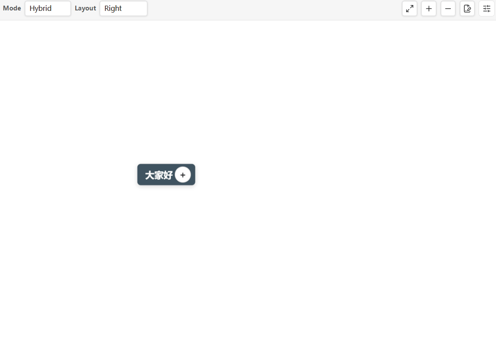

# Obu Mindmap

**English** | [简体中文](README_zh-CN.md)

Obu Mindmap is a Markdown-native mind map plugin for Obsidian. It edits headings and nested lists as an interactive mind map while keeping the source readable, portable, and compatible with existing `type: mindmap` notes.

Obu Mindmap is based on Stratify Mindmap and keeps its Markdown data format. The plugin has its own ID, settings, installation directory, version, repository, and release channel.

## Highlights

- Heading, Hybrid, and List structures
- Ordered and unordered list recognition with marker-preserving edits
- Balanced, left, right, tree, and radial layouts
- Keyboard editing, navigation, drag-and-drop, links, and wiki links
- Per-note default view: Mind Map or Markdown
- Persistent node folding without consuming Markdown italic syntax
- Visible, accessible `+/-` controls on every branch
- Explicit migration for legacy `*collapsed node*` markers
- Clean Markdown export with complete frontmatter removal
- PNG export, themes, connector styles, and node styles
- Desktop and mobile support



## Markdown format

Obu Mindmap continues to identify notes with:

```yaml
---
type: mindmap
---
```

It also continues to read the existing fields:

```yaml
mindmap-structure:
mindmap-layout:
mindmap-theme:
mindmap-line:
mindmap-node:
```

No `type: obu-mindmap` conversion is required.

### New mind maps

A newly created map contains the selected global defaults plus the new per-note fields:

```yaml
---
type: mindmap
mindmap-structure: hybrid
mindmap-layout: balanced
mindmap-theme: minimal
mindmap-line: curve
mindmap-node: rounded
mindmap-default: mindmap
mindmap-collapse-version: 2
mindmap-collapsed: []
---

# New
```

## Per-note default view

Use either:

```yaml
mindmap-default: mindmap
```

or:

```yaml
mindmap-default: markdown
```

Run **Obu Mindmap: Toggle default view** to change the current note and immediately apply the result. The setting is applied once when a file enters a leaf or the leaf switches files; later scans do not override a manual view switch.

The **Default view for new mind maps** setting is used by new maps and notes without `mindmap-default`. An invalid per-note value safely falls back to Mind Map.

## Persistent folding

Version 2 stores folding in frontmatter:

```yaml
mindmap-collapse-version: 2
mindmap-collapsed:
  - Project%2FPlan[1]/Design[1]
```

The Markdown body remains standard:

```markdown
# Project/Plan

## Design

### Backend
```

Paths include ancestor titles and same-name sibling numbers. Special path characters are encoded. Missing paths are ignored and never matched approximately.

Each branch shows:

- `−` when expanded
- `+` when collapsed
- no button when the node has no children

Click the button, press `Space`, or use the context menu. Editing a collapsed branch or dropping a child into it expands it automatically.

## Migrating legacy collapse markers

Older Stratify notes may store folding as:

```markdown
## *Requirements*
```

They continue to open without conversion. Run **Obu Mindmap: Migrate legacy collapse markers** when you want to move that note to version 2. The command:

1. detects old heading and list markers;
2. writes `mindmap-collapse-version: 2` and `mindmap-collapsed`;
3. removes only the outer legacy stars;
4. records one complete Undo/Redo snapshot;
5. reports the migrated node count.

Migration is never performed silently. In a version 2 file, `*italic text*` is normal Markdown italics and does not mean “collapsed.”

## Export clean Markdown

Run **Obu Mindmap: Export clean Markdown** to create a standard Markdown copy beside the source note.

- The complete frontmatter block is removed, including `type`, `mindmap-*`, tags, aliases, and custom properties.
- The original body is preserved, including hidden descendants, paragraphs, links, code blocks, tables, quotes, and blank lines.
- The source note is not modified.
- Existing files are never overwritten.

The first available name is selected:

```text
Project-clean.md
Project-clean-2.md
Project-clean-3.md
```

The exported file contains no Obu-specific marker and can be imported by Markdown tools such as Mubu (幕布). For the best hierarchy, use Heading mode or a regular nested-list structure before exporting.

## Moving from Stratify Mindmap

1. Disable Stratify Mindmap.
2. Install and enable Obu Mindmap.
3. Open the existing `type: mindmap` notes directly.
4. Recreate the desired global defaults once.
5. Optionally run the legacy collapse migration command per note.

Per-note structure, layout, theme, line, and node fields remain in the Markdown file. Global settings are stored separately under the Obu plugin ID and are not copied automatically.

Do not enable Obu Mindmap and Stratify Mindmap at the same time because both handle the same `type: mindmap` notes.

## Installation

### From a release

1. Download `main.js`, `manifest.json`, and `styles.css` from an Obu Mindmap release.
2. Create `<vault>/.obsidian/plugins/obu-mindmap/`.
3. Copy the three files into that directory.
4. Reload Obsidian.
5. Enable **Obu Mindmap** under **Settings → Community plugins**.

### From source

```bash
npm ci
npm run build
```

Copy `main.js`, `manifest.json`, and `styles.css` into `.obsidian/plugins/obu-mindmap/`.

## Development

```bash
npm ci
npm run dev
```

Before releasing:

```bash
npm run check
node scripts/verify-release.mjs
```

`npm run check` runs ESLint, TypeScript compilation, the production build, core behavior tests, and plugin regression tests.

## Privacy

Obu Mindmap works locally and offline. It does not collect telemetry, display ads, access files outside the current vault, or provide its own cloud service.

## Credits

Obu Mindmap is based on Stratify Mindmap by Lywooye,
which is derived from Light Mindmap by Light Ning.

Obu-specific features and ongoing maintenance are provided by
DesenbergChina.

## License

Limited Personal License. Obu-specific modifications may not be redistributed,
modified, or used to create derivative works without prior written permission.
Portions inherited from upstream projects remain available under their original
MIT terms. See [LICENSE](LICENSE) for the complete terms and copyright notices.
